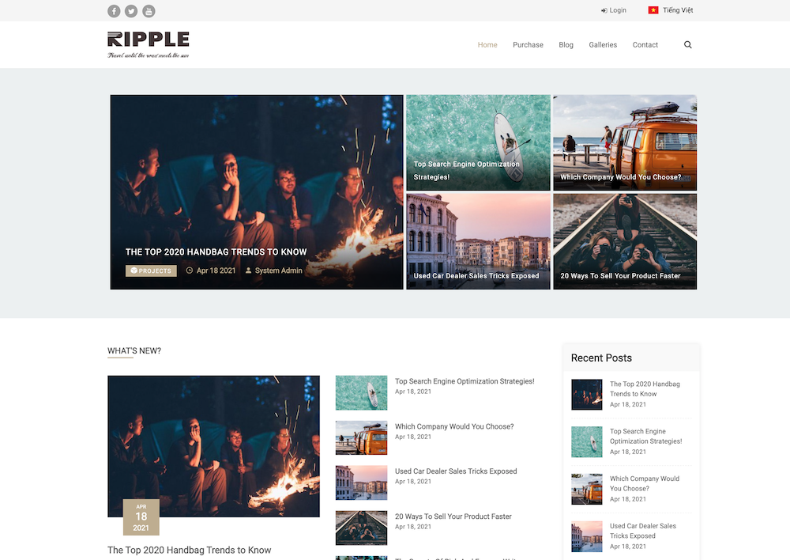

# THEME - ThemPho - VSPHIM CMS

## Demo
### Trang Chủ


## Requirements
- Laravel Framework: ^6|^7|^8
- PHP: ^7.3|^8.0
- [vsphim/vsphim-core](https://github.com/vsphim/vsphim-core): ^1.0.0

## Install
1. Tại thư mục của Project: `composer require vsphim/theme-thempho`
2. Chạy migrations để tạo các bảng cần thiết cho theme:
   ```bash
   php artisan migrate
   ```
   Theme này yêu cầu các bảng bổ sung: `comments`, `follows`, `histories`
3. Kích hoạt giao diện trong Admin Panel

## Update
1. Tại thư mục của Project: `composer update vsphim/theme-thempho`
2. Chạy migrations nếu có cập nhật:
   ```bash
   php artisan migrate
   ```
3. Re-Activate giao diện trong Admin Panel

## Document
### List
- Trang chủ: `display_label|relation|find_by_field|value|limit|show_more_url|show_template(block_thumb|top)`
    ```
    Mới nhất||is_copyright|0|10|/danh-sach/phim-bo|block_thumb
    Phim hay||is_copyright|0|10|#|top
    ```

### Custom View Blade
- File blade gốc trong Package: `/vendor/vsphim/theme-thempho/resources/views/themethempho`
- Copy file cần custom đến: `/resources/views/vendor/themes/themethempho`
